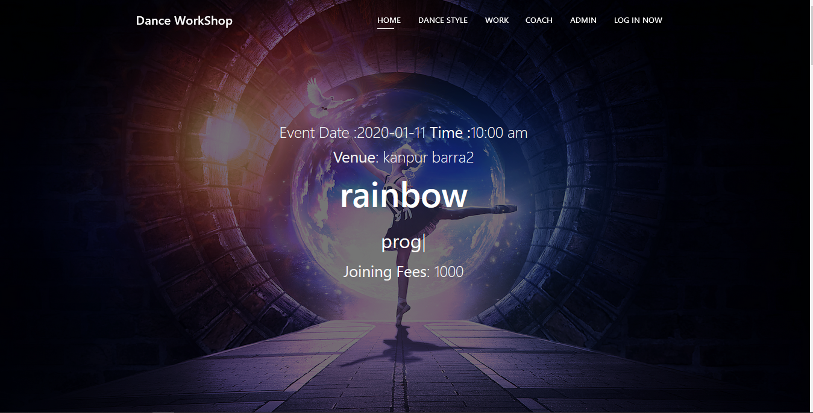
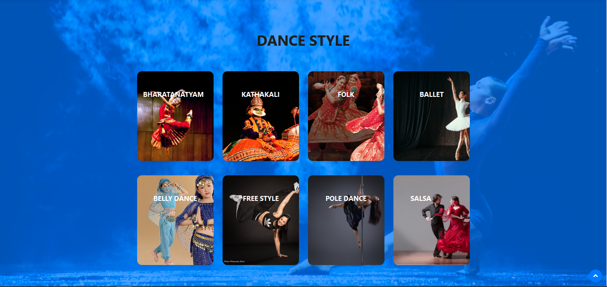
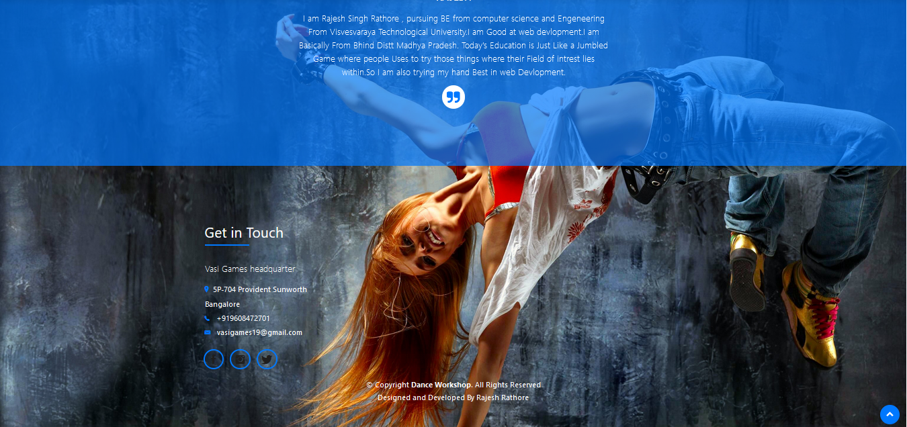
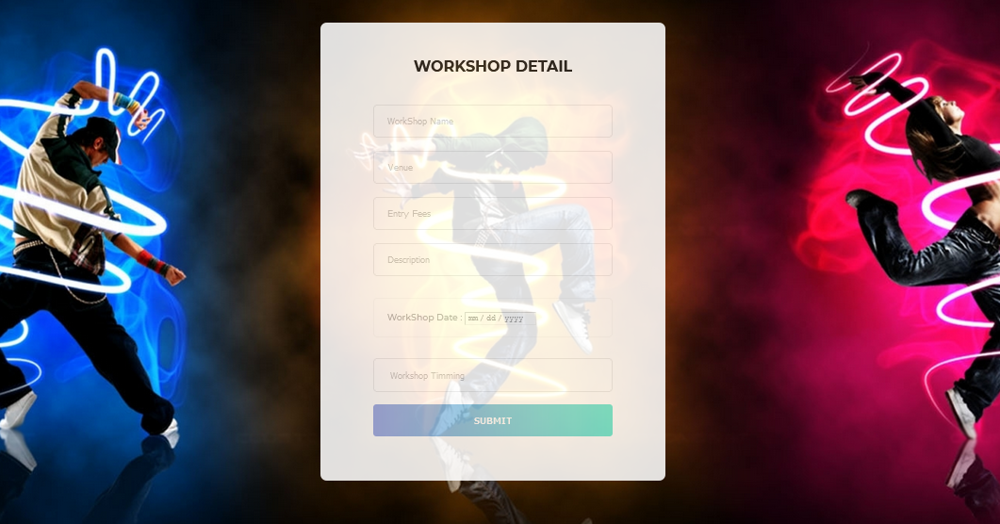
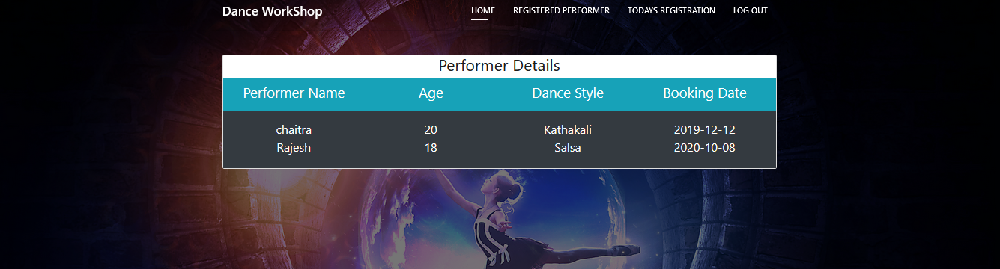
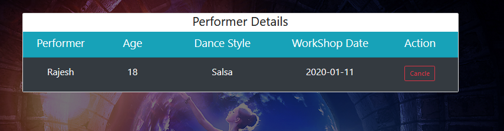

# Dance Workshop Management System: Streamlining Participant and Coach Data with MySQL

this database management system is a valuable tool for dance workshop organizers who want to streamline their operations and manage their data more efficiently. Its user-friendly interface and powerful features make it an ideal choice for anyone looking to organize and manage a successful dance workshop

## Technology used :

phpmyadmin used for mysql database

php used for backend

html5 , css ,javascript and bootstrap4 for frontend

Xampp server

Guidline :

step 1:- Install Xampp

step 2:- Open Xampp folder and paste the whole project inside htdocs folder

step 3:- Start Xampp server and start apache and mysql

step 4:- open phpmyadmin using this link http://localhost/phpmyadmin/ and create a database with name (dance) name should be same otherwise it so error

step 5:- inside the project folder a file is dance.sql is import in phpmyadmin inside dance database

step 6:- check your project http://localhost/danceworkshop/

step 7:- admin username :-admin and password : admin

if any query you can contact me at any time at linkedIn :-https://www.linkedin.com/in/rajesh-rathore-409a0316b/

### If it is helpfull for you please give star

## Topview of index page

     

## dance styles that provide to perform on the stage 

    

## footer section

    

## Add workshop 
after admin login, can add workshop 

    

## details admin and user can see

    

    

## Connect with me ~Rajesh Rathore

***Do star, fork and share the repo to show your support, it would help others too!***    
  
 Let me know your views or any changes or improvements or contribute to make better for others 
 
 :heart: ***Thank you all for Forking this repository and contribute***  :heart:
